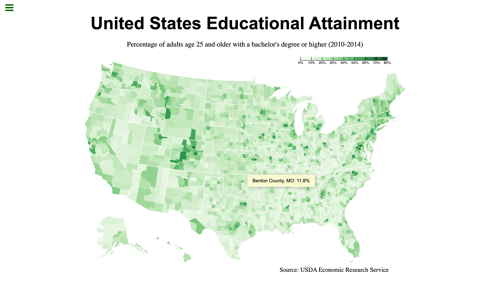

# freeCodeCamp - Visualize Data with a Choropleth Map

This is a solution to the [Visualize Data with a Choropleth Map](https://www.freecodecamp.org/learn/data-visualization/data-visualization-projects/visualize-data-with-a-choropleth-map) on freeCodeCamp.

## Table of contents

- [Overview](#overview)
  - [The challenge](#the-challenge)
  - [Screenshot](#screenshot)
  - [Links](#links)
- [My process](#my-process)
  - [Built with](#built-with)
  - [What I learned](#what-i-learned)
  - [Useful resources](#useful-resources)
- [Author](#author)

## Overview

### The challenge

Users should be able to:

- View the optimal layout for the site depending on their device's screen size
- Display the land-surface temperature changes from 1753 to 2015
- Interact with the heat map graph to learn about further information in each heat cell

### Screenshot

<table>
  <tr>
    <td>
      
    </td>
  </tr>
</table>

### Links

- Live Site URL: [here](https://zun-liang.github.io/fcc-d3-choropleth-map)

## My process

### Built with

- HTML
- CSS
- TypeScript
- D3.js
- Vite
- Mobile-first workflow

### What I learned

### Helpful Resources

## Author

- Website - [Zun Liang](https://zunldev.com/)
- GitHub - [@zun-liang](https://github.com/zun-liang)
- Frontend Mentor - [@zun-liang](https://www.frontendmentor.io/profile/zun-liang)
- freeCodeCamp - [@zun-liang](https://www.freecodecamp.org/zun-liang)
